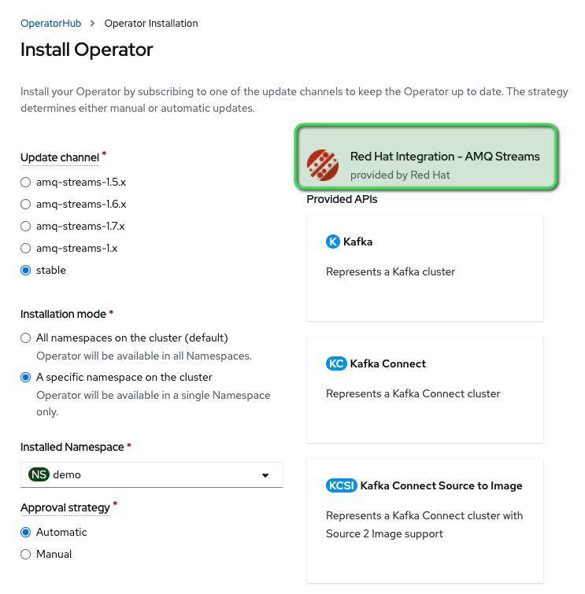
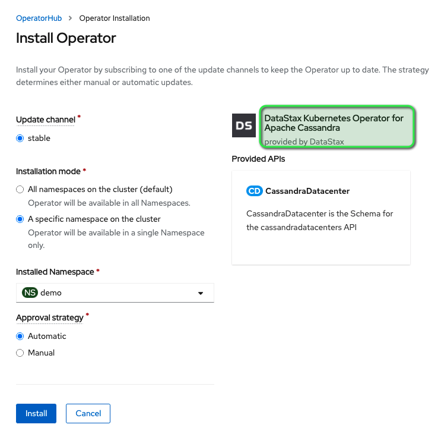
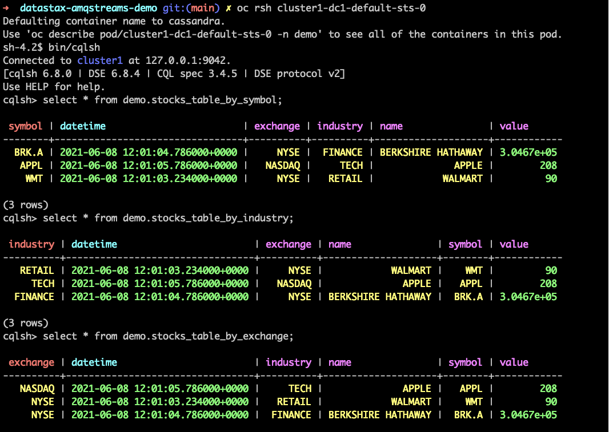

# datastax-amqstreams-demo
Datastax integration with AMQ Streams using Kafka Connect on Openshift

First, clone this github repo:
```
git clone https://github.com/ramgopireddy/datastax-amqstreams-demo.git
```

# Installing Operators
We will install AMQ Streams (Red Hat Kafka) and Datastax operators.

**Create a new project named "demo"**: 
```
oc new-project demo

cd datastax-amqstreams-demo
```

**Install Datastax operator pre-reqs**: 
Clone this github repo:
```
oc apply -f 01-dse-Operator-Dependencies.yaml
```
**Install AMQ Streams Operator from OperatorHub with options shown below**: 

   


**Install Datastax Operator from OperatorHub whith options shown below**: 

   

**Edit Datastax operator yaml**: 
Update the operator yaml to use a custom image to work around a SCC related issue. This is expected to be resolved in the next minor release.
```
image: 'jsanda/cass-operator:securitycontext'
containerImage: 'jsanda/cass-operator:securitycontext'
```
# Deploy Kafka and Datastax Clusters
We will install AMQ Streams (Red Hat Kafka) and Datastax operators.

**Create Datastax Cluster**: 
The cluster takes a few minutes to come up. 

```
oc apply -f 02-dse-cluster.yaml
```
**Create Kafka Cluster**: 
```
oc apply -f 03-kafka-cluster.yaml
```
Wait for both cluster to be ready before proceeding. The Developer console should looks like this:


**Create Kafka Connect cluster with Datastax plugin**: 
```
oc apply -f 04-KafkaConnect-Cluster.yaml
```

# Create tables in Datastax cluster

**rsh into Datastax pod**
```
oc rsh cluster1-dc1-default-sts-0

bin/cqlsh

```
**Create tables**

```
CREATE KEYSPACE demo WITH replication = {'class': 'SimpleStrategy', 'replication_factor': '1'};

create table if not exists demo.stocks_table_by_symbol (symbol text, datetime timestamp, exchange text, industry text, name text, value double, PRIMARY KEY (symbol, datetime));
create table if not exists demo.stocks_table_by_exchange (symbol text, datetime timestamp, exchange text, industry text, name text, value double, PRIMARY KEY (exchange, datetime));
create table if not exists demo.stocks_table_by_industry (symbol text, datetime timestamp, exchange text, industry text, name text, value double, PRIMARY KEY (industry, datetime));

```

**Create kafka connector** 

This connector reads from stock-stream topic and insert all three tables created in the previous step

```
oc apply -f 06-StockStream-Connector.yaml
```
# Test End-to-End flow

**Send messages to stock-stream topic**
```
oc rsh my-cluster-kafka-0

./bin/kafka-console-producer.sh --bootstrap-server my-cluster-kafka-bootstrap:9092 --topic stock-stream --property "parse.key=true" --property "key.separator=:"

```

**Paste the following messages at the prompt. More records found in 07-MessageProducer.txt**

```
WALMART:{"symbol":"WMT", "datetime":"2021-06-08T12:01:03.234", "exchange":"NYSE", "industry":"RETAIL", "value":90}
BERKSHIRE HATHAWAY:{"symbol":"BRK.A", "datetime":"2021-06-08T12:01:04.786", "exchange":"NYSE", "industry":"FINANCE", "value":304671}
APPLE:{"symbol":"APPL", "datetime":"2021-06-08T12:01:05.786", "exchange":"NASDAQ", "industry":"TECH", "value":208}
EXXON MOBIL:{"symbol":"XOM", "datetime":"2021-06-08T12:01:06.786", "exchange":"NYSE", "industry":"ENERGY", "value":80}
```

**Verify data inserted into tables in the Datastax terminal**

```
select * from demo.stocks_table_by_symbol;
select * from demo.stocks_table_by_industry;
select * from demo.stocks_table_by_exchange;

```
   

